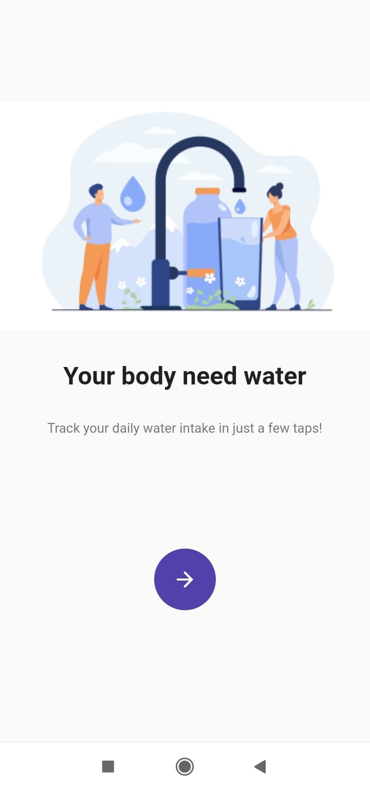
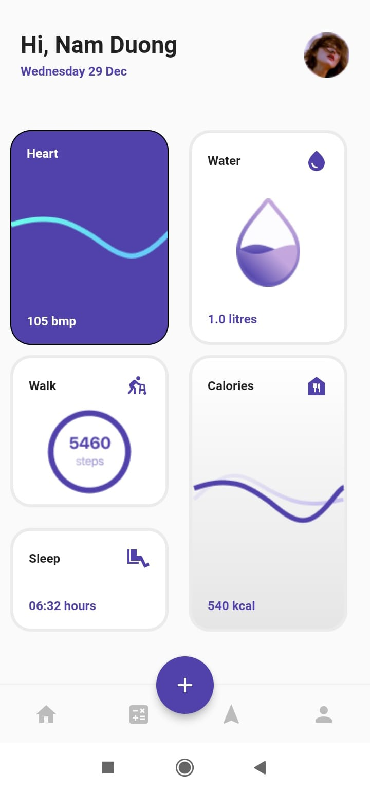
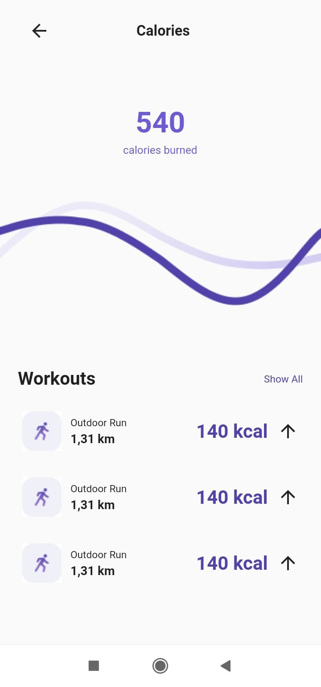
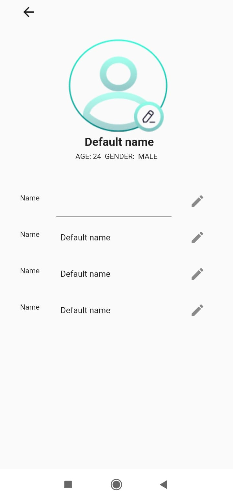

# Hydration and Health App

A comprehensive health app that helps you track your daily water intake and monitor various health metrics such as sleep, calorie consumption, and heart rate.

## Features

- **Water Intake Tracker**: Log and monitor your daily water consumption.
- **Sleep Tracker**: Record and analyze your sleep patterns.
- **Calorie Tracker**: Track your daily calorie intake and expenditure.
- **Heart Rate Monitor**: Keep track of your heart rate readings.
- **Comprehensive Dashboard**: View all your health metrics in one place.

## Screenshots

  
  
  
  

